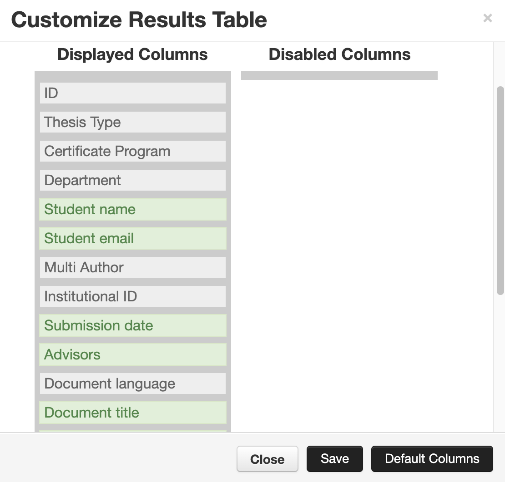
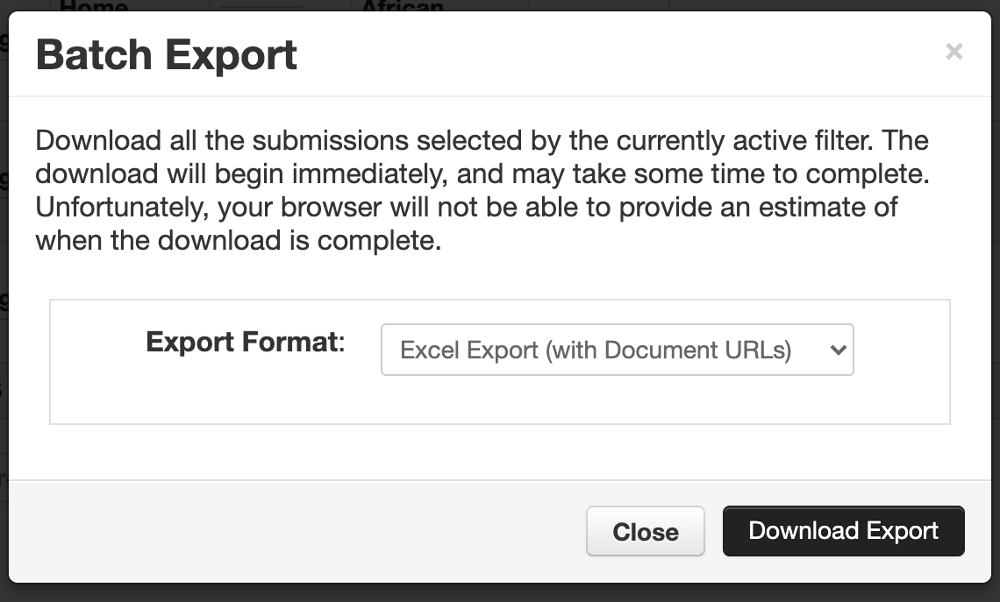
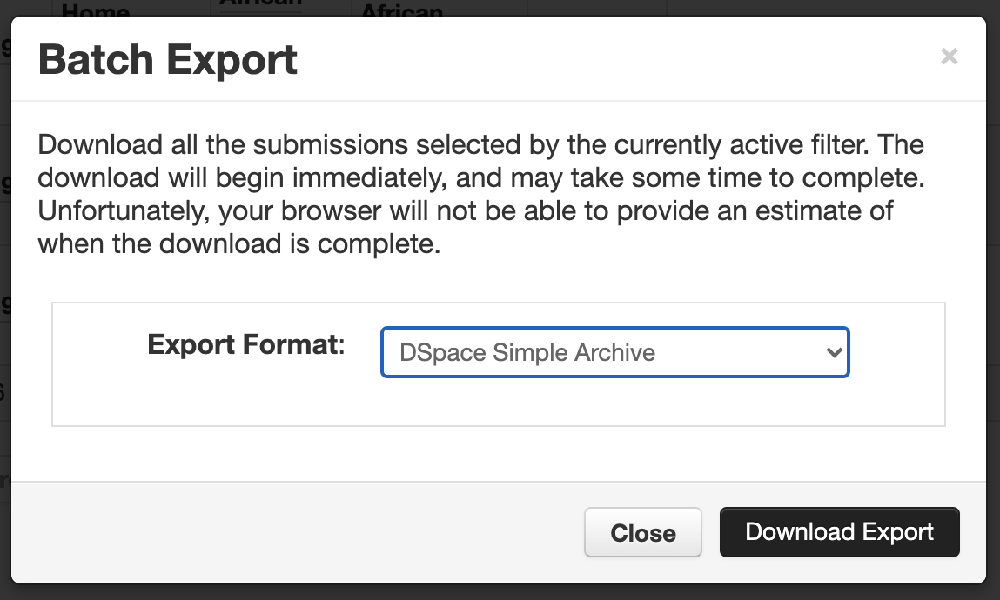
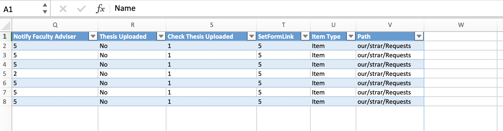
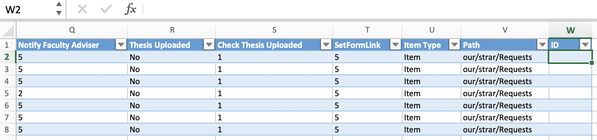

# Importing DataSpace Items

## Importing Thesis Central (Vireo) submissions into DataSpace (DSpace)
Thesis Central submissions are organized by academic departments.

## Preparing a local environment

### Installing `pipenv`

```
# For Python 3.x support:
pyenv local 3.8.3

# Or, for legacy support:
pyenv local 2.7.18

pip install pipenv
```

### Installing the Python package dependencies

#### 3.8.3

```
pipenv --python 3.8.3 shell
pip install lxml pandas openpyxl
```

#### 2.7.18

```
pipenv --python 2.7.18 shell
pip install lxml pandas openpyxl
```

### Download Ghostscript

The workflow requires Ghostscript to add the cover page. Download on Mac with `brew install ghostscript` or follow the directions on [their website](https://www.ghostscript.com)

### Tunneling over SSH

In order to execute these scripts, one must first tunnel over SSH for copying
files using `scp`:

```bash
ssh -L 1234:dataspace.princeton.edu:22 $USER@epoxy.princeton.edu
```

...where `$USER` is an OIT service account used to access the production or QA
server environments for DSpace.

## Exporting from Thesis Central
Users must export Excel Spreadsheet after selecting a department from [Thesis Central](https://thesis-central.princeton.edu/).

Please note that one must include the following columns in the export:

* ID
* Thesis Type
* Certificate Program
* Department
* Student name
* Student email
* Multi Author
* Institutional ID
* Submission date
* Advisors
* Document language
* Document title
* Status
* Primary document
* Approval date
* Event time

Please note that the `status` value of `Submitted` will not be assumed to be
`Approved`, hence, these will simply not be handled by the import scripts.



One then exports both the `Excel Export (with Document URLs)`:



...as well as the `DSpace Simple Archive`:



Please download the Excel Export into `downloads/$department/ExcelExport.xlsx`, and the 
DSpace Simple Archive into `downloads/$department/DSpaceSimpleArchive.zip`.

```
/bin/tcsh
set department="Physics"
mkdir "downloads/$department"
```

## Applying Restrictions

One must then export the submission restrictions from the University Sharepoint
provided by the Office of the Registrar (please download the latest export from 
[Google Drive](https://drive.google.com/file/d/1yVsV5PG-WPtj-eV7lHGRbuj3sVUGdwZh/view?usp=sharing) to `downloads/Restrictions.xlsx`).

Then, one must copy the file, and add an `ID` column to this exported Spreadsheet:
```
cp downloads/Restrictions.xlsx downloads/RestrictionsWithId.xlsx
```




Finally, one must update the spreadsheet with the following:

```bash
/bin/tcsh
set department="Mechanical & Aerospace Engr"

pipenv install lxml pandas
cp -r "downloads/$department" "export/"
# This shouldn't be necessary, but requires that the Python scripts be rewritten
cp downloads/RestrictionsWithId.xlsx export/RestrictionsWithId.xlsx

cp downloads/RestrictionsWithId.xlsx "export/$department/RestrictionsWithId.xlsx"

python restrictionsFindIds.py --thesis "export/$department/ExcelExport.xlsx" --restrictions "export/$department/RestrictionsWithId.xlsx"

cp ImportRestrictions.xlsx "export/$department/RestrictionsWithId.xlsx"
```

## Adding the Academic Programs

Academic programs are listed in a spreadsheet located on [Google
Drive](https://drive.google.com/file/d/1K_rrBPY-Pf3DcqbCS-ZxYFjMQl3bIYEM/view?usp=sharing).

This should please be downloaded and copied with the following:
```
cp export/AdditionalPrograms.xlsx "export/$department/AdditionalPrograms.xlsx"
```

## Building DSpace Submission Information Packages (SIPs)

Please note that this assumes that you have downloaded the Thesis Central 
departmental Excel Spreadsheet into `downloads/ExcelExport.xlsx`, and
the departmental DSpace Simple Archive into `downloads/DSpaceSimpleArchive.zip`.

### Cleaning the Environment

```bash
/bin/tcsh
set department="English"
source clean-simple-archives
```

### Initializing the Environment

```bash
/bin/tcsh
set department="English"

cd "export/$department"
unzip DSpaceSimpleArchive.zip
cd -
```

### Building SIPs

```bash
/bin/tcsh
set department="English"
pipenv install lxml pandas

# Please note that the DSpaceSimpleArchive is decompressed
cd "export/$department"
rm -r ./DSpaceSimpleArchive
unzip DSpaceSimpleArchive.zip
cd -

source prepare-to-dataspace "export/$department"
```

#### Rebuilding SIPs

```
rm "export/$department/enhanceAips.trace"
rm "export/$department/$department.tgz"
rm -fr "export/$department/DSpaceSimpleArchive"
rm -fr "export/$department/Approved"
rm -fr "export/$department/Multi-Author"
cd "export/$department"
unzip DSpaceSimpleArchive.zip
```

## Multi-Author Submissions

```bash
/bin/tcsh
set department="Mechanical & Aerospace Engr"
source clean-simple-archives
source init-simple-archives
```

```bash
/bin/tcsh
set department="Mechanical & Aerospace Engr"
pipenv install lxml pandas

source prepare-to-dataspace "export/$department"
```

### Transfer the SIPs to the server

```bash
/bin/tcsh
set user=SSH_USER
set host=updatespace.princeton.edu # Or, for production, dataspace.princeton.edu
set department="Mechanical & Aerospace Engr"

scp -P 1234 "export/$department/$department.tgz" $user@localhost:"/var/scratch/thesis-central/"
ssh -J $user@epoxy.princeton.edu $user@$host chmod o+r "/var/scratch/thesis-central/$department.tgz"
```

## Import to DataSpace

From the DataSpace server environment, please invoke the following:

```bash
/bin/tcsh
ssh -J $user@epoxy.princeton.edu $user@$host
sudo su - root
su - dspace
set department="Mechanical & Aerospace Engr"
cd ~/thesiscentral-vireo/dataspace/import
```

One must ensure that the directory used for imports is clean of previous import
procedures:

```bash
rm -rf "/dspace/www/thesis_central/$department/tc_export/"
```

Then please invoke:

```bash
/bin/tcsh
set collection_handle = 88435/dsp01qf85nb35s # Or, the appropriate Collection ARK
set eperson = jrg5@princeton.edu # Or, your own user name
set mapfile = import-`date +%s`

source ./unwrap

# This is necessary until the unwrap procedure is reimplemented

mkdir tc_export
```

#### Multi-Author Submissions
```
cp -r ./Multi-Author/Approved tc_export/
cp -r ./Multi-Author/Cancelled tc_export/

/dspace/bin/dspace import --add --collection $collection_handle --eperson $eperson --mapfile "import-$department-multi-accepted.map" --source "/dspace/www/thesis_central/$department/tc_export/Approved" --workflow

/dspace/bin/dspace import --add --collection $collection_handle --eperson $eperson --mapfile "import-$department-multi-cancelled.map" --source "/dspace/www/thesis_central/$department/tc_export/Cancelled" --workflow

cp -r ./Approved tc_export/

/dspace/bin/dspace import --add --collection $collection_handle --eperson $eperson --mapfile "import-$department.map" --source "/dspace/www/thesis_central/$department/tc_export/Approved" --workflow
```

#### Single Author Submissions
```
cp -r ./Approved tc_export/

# Mapfiles must be removed, or else the DSpace import command will fail
rm "import-$department.map"

/dspace/bin/dspace import --add --collection $collection_handle --eperson $eperson --mapfile "import-$department.map" --source "/dspace/www/thesis_central/$department/tc_export/Approved" --workflow
```

