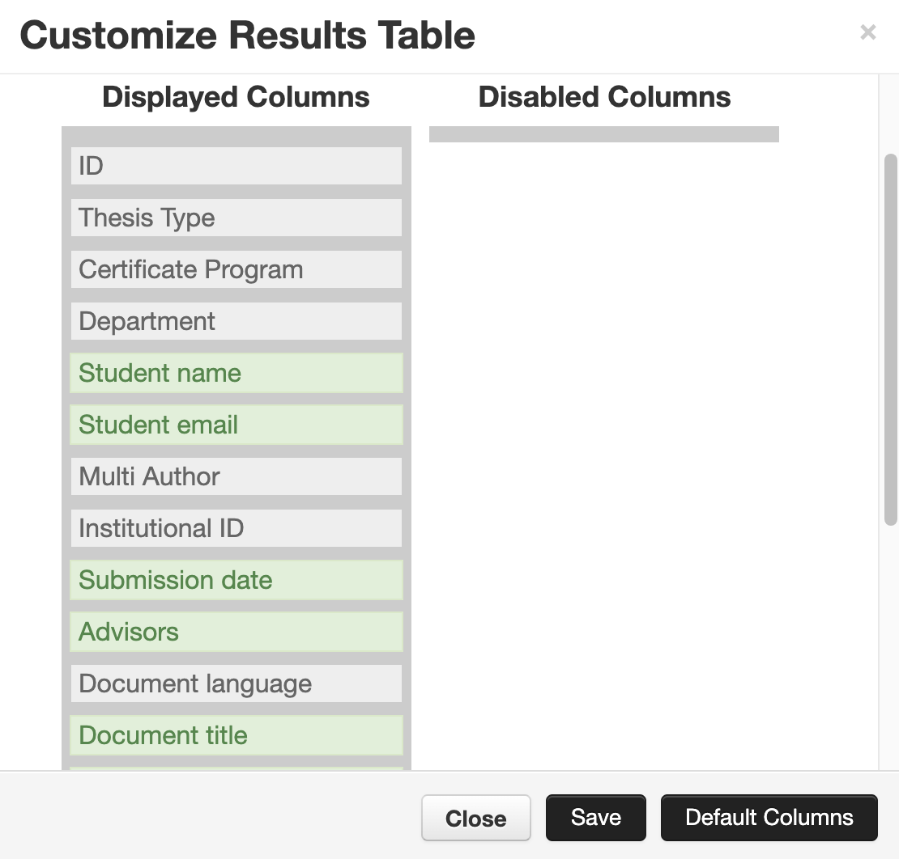
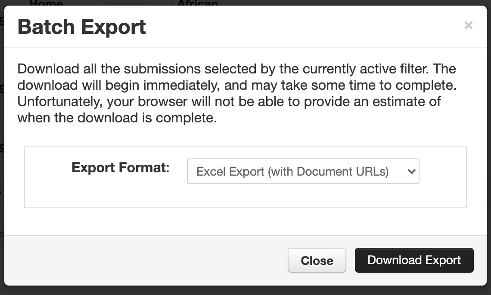
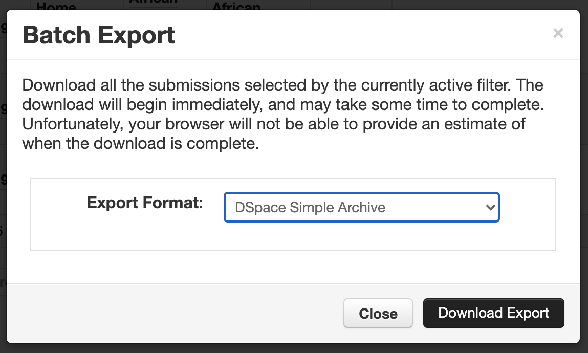
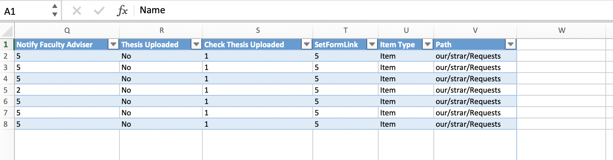
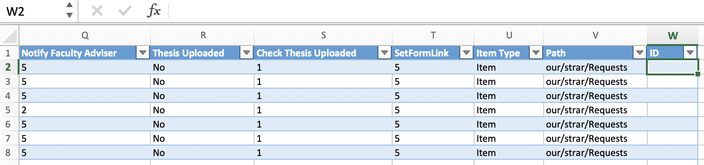

# Importing DataSpace Items

## Importing Thesis Central (Vireo) submissions into DataSpace (DSpace)
Thesis Central submissions are organized by academic departments.

## Preparing a local environment

### Installing `pipenv`

```
# For Python 3.x support:
pyenv local 3.8.3

# Or, for legacy support:
pyenv local 2.7.18

pip install pipenv
```

### Installing the Python package dependencies

#### 3.8.3

```
pipenv --python 2.7.18 shell
pipenv lock --pre
pipenv install
```

#### 2.7.18

```
cp Pipfile.legacy Pipfile
cp Pipfile.legacy.lock Pipfile
pipenv --python 2.7.18 shell
pipenv lock --pre
pipenv install
```

### Tunneling over SSH

In order to execute these scripts, one must first tunnel over SSH for copying
files using `scp`:

```bash
ssh -L 1234:dataspace.princeton.edu:22 $USER@epoxy.princeton.edu
```

...where `$USER` is an OIT service account used to access the production or QA
server environments for DSpace.

## Exporting from Thesis Central
Users must export Excel Spreadsheet after selecting a department from [Thesis Central](thesis-central.princeton.edu).

Please note that one must include the following columns in the export:

* ID
* Thesis Type
* Certificate Program
* Department
* Student name
* Student email
* Multi Author
* Institutional ID
* Submission date
* Advisors
* Document language
* Document title
* Status
* Primary document
* Approval date
* Event time

Please note that the `status` value of `Submitted` will not be assumed to be
`Approved`, hence, these will simply not be handled by the import scripts.



One then exports both the `Excel Export (with Document URLs)`:



...as well as the `DSpace Simple Archive`:



Please download the Excel Export into `~/Download/thesis_central_export.xlsx`, 
and the DSpace Simple Archive into `~/Download/dspace_simple_archive.zip`.

## Applying Restrictions

One must then export the submission restrictions from the University Sharepoint
provided by the Office of the Registrar (please download the latest export from 
[Google Drive](https://drive.google.com/file/d/1yVsV5PG-WPtj-eV7lHGRbuj3sVUGdwZh/view?usp=sharing)).

Then, one must add an `ID` column to this exported spreadsheet:




```bash
/usr/bin/env python restrictionsFindIds.py
```

## Adding the Academic Programs

Academic programs are listed in a spreadsheet located on [Google
Drive](https://drive.google.com/file/d/1K_rrBPY-Pf3DcqbCS-ZxYFjMQl3bIYEM/view?usp=sharing).

This should please be downloaded and copied with the following:
```
cp ~/AdditionalPrograms.xlsx export/AdditionalPrograms.xlsx
cp ~/AdditionalPrograms.xlsx export/$department/AdditionalPrograms.xlsx
```

## Building DSpace Submission Information Packages (SIPs)

Please note that this assumes that you have downloaded the Thesis Central 
departmental Excel Spreadsheet into `~/Download/thesis_central_export.xlsx`, and
the departmental DSpace Simple Archive into `~/Download/dspace_simple_archive.zip`.

### Cleaning the Environment

```bash
/bin/tcsh
set department="English"
source clean-simple-archives
```

### Rebuilding SIPs

```bash
/bin/tcsh
set department="English"
source prepare-to-dataspace export/$department
```

### Building SIPs

```bash
/bin/tcsh
set department="English"
set user=MY_SSH_USER
set host=updatespace.princeton.edu # Or, for production, dataspace.princeton.edu
mkdir export/$department
cp ~/Download/thesis_central_export.xlsx export/$department/ExcelExport.xlsx
cp ~/Download/dspace_simple_archive.zip export/$department/
cd export/$department
unzip dspace_simple_archive.zip
cd -
source prepare-to-dataspace export/$department
scp -P 1234 export/$department.tgz $user@localhost:/var/scratch/thesis-central/$department.tgz
ssh -J $user@epoxy.princeton.edu $user@$host chmod o+r /var/scratch/thesis-central/$department.tgz
```

### Multi-Author Submissions

```bash
/bin/tcsh
cd export/Multi-Author
check_all_approved

combine_all_approved
check_after_combine
```

#### Transfer the SIPs to the server

```bash
/bin/tcsh
set department="Multi-Author"
(cd export; tar cfz $department.tgz ./$department)
scp -P 1234 $department.tgz $user@localhost:/var/scratch/thesis-central/$department.tgz
ssh -J $user@epoxy.princeton.edu $user@$host /usr/bin/chmod o+r /var/scratch/thesis-central/$department.tgz
```

## Import to DataSpace

From the DataSpace server environment, please invoke the following:

```bash
/bin/tcsh
ssh -J $user@epoxy.princeton.edu $user@$host
su - root
su - dspace
cd ~/thesiscentral-vireo/dataspace/import
```

One must ensure that the directory used for imports is clean of previous import
procedures:

```bash
unlink /dspace/www/thesis_central/$department/$department.tsv
unlink /dspace/www/thesis_central/$department/Approved
rm -r /dspace/www/thesis_central/$department/tc_export/
```

Then please invoke:

```bash
./unwrap

# Just cut and paste the derived .tgz file from the prompt
# Test access for the directories at https://dataspace.princeton.edu/www/thesis_central/

# Then import to DSpace using the following:
./import
```

